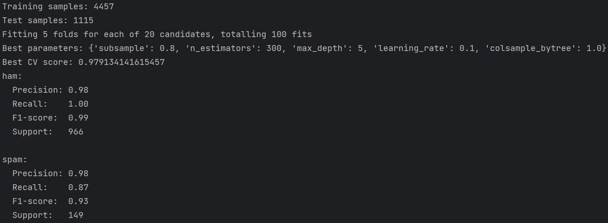
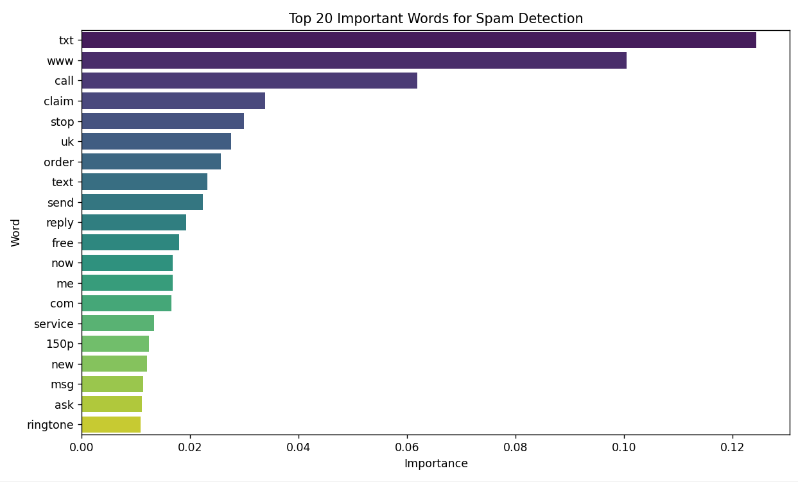

- Technology used: PyCharm IDE; Python 3.13.5
- Data used: Kim, E. & UCI Machine Learning. (2016, December 2). SMS Spam Collection Dataset. Kaggle. https://www.kaggle.com/datasets/uciml/sms-spam-collection-dataset 

Works Cited

1. *XGBoost.* (2025, October 24). GeeksforGeeks. Retrieved November 27, 2025, from https://www.geeksforgeeks.org/machine-learning/xgboost/ 
2. *Precision-Recall Curve - ML.* (2025, July 12). GeeksforGeeks. Retrieved November 27, 2025, from https://www.geeksforgeeks.org/machine-learning/precision-recall-curve-ml/ 
3. *Understanding TF-IDF (Term Frequency-Inverse Document Frequency).* (2025, August 13). GeeksforGeeks. Retrieved November 27, 2025, from  https://www.geeksforgeeks.org/machine-learning/understanding-tf-idf-term-frequency-inverse-document-frequency/ 
4. *Stratified K Fold Cross Validation.* (2025, July 15). GeeksforGeeks. Retrieved January 8, 2026, from https://www.geeksforgeeks.org/machine-learning/stratified-k-fold-cross-validation/ 
5. *XGBoost Parameters.* (2025, July 23). GeeksforGeeks. Retrieved January 8, 2026, from https://www.geeksforgeeks.org/machine-learning/xgboost-parameters/ 

<!-- 

  

<b>Resulting Diagrams</b>

<!-- 

  

  

  

 -->
