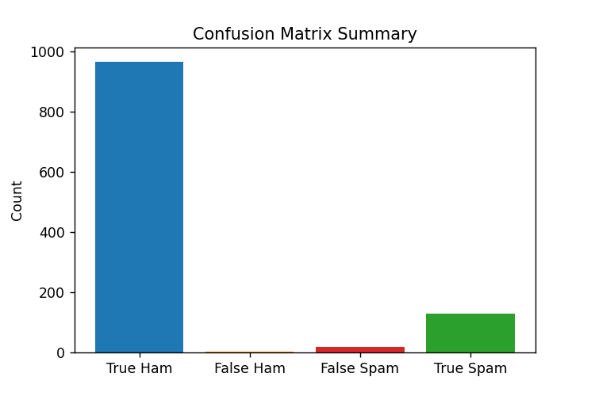
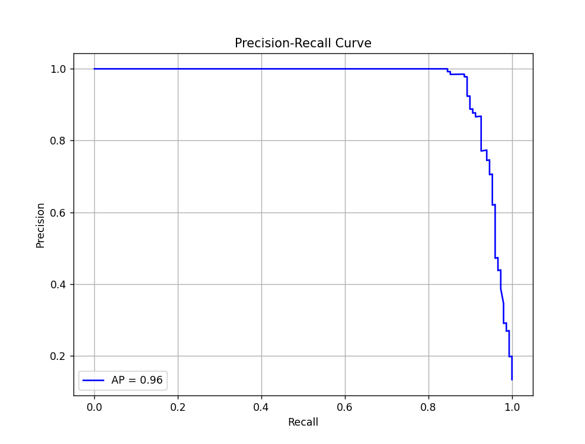

<b>Machine Learning Spam Message Classifier</b>

 

  

This project builds, tunes, and evaluates a <b>spam message classifier using XGBoost</b> and TF-IDF text features, then visualizes how well the model performs and which words matter most. XGBoost involves "[...] decision trees as its base learners and combines them sequentially to improve the model’s performance. Each new tree is trained to correct the errors made by the previous tree and this process is called boosting" ("XGBoost", 2025, para. 1).  The labels ham and spam are converted to numbers 0 and 1, XGBoost runs a binary classifier for spam vs ham and configures it to optimize log loss ("divergence of predicted probability with the actual label") and be reproducible with a fixed random seed ("ML | Log Loss [...]", 2025, para. 1). This model's hyperparameters are tuned with <b>RandomizedSearchCV</b> and <b>Stratified K-Fold cross-validation</b>. Stratified K-Fold cross-validation makes sure the training and testing sets are in the same proportions as to full dataset - good for imbalanced data ("Stradified [...]", 2025, paras. 1, 8). Randomized search hyperparameter tuning can have less wait time than grid search, because random selections of the ranges specified are tried versus all combinations ("Comparing Randomized [...]", 2025, paras. 3, 7). 
  
 

  

  
 
The <b>confusion matrix</b> shows: ("Precision-Recall Curve - ML", 2025, para. 11)
<ul>
  <li>Correctly classified spam (True Positive)</li>
  <li>Misclassified ham (False Positive)</li>
  <li>Correctly classified ham (True Negative)</li>
  <li>Misclassified spam (False Negative)</li>
</ul>

  

  
 
The <b>precision recall curve</b> helps determine the positive class (in this case spam) where recall (x-axis) is the true positive rate of spam and precision (y-axis) is how many predicted spam were correct ("Precision-Recall Curve - ML", 2025, paras. 1-4).
  
 

  

  
 
The best cross validation score is given for 5-folds in this model, evaluated as a percentage ("Cross Validation in Machine Learning", 2025, para. 31).
The results list the precision and recall scores, along with F1 scores showing how well the model performs on unbalanced data, and lastly, support, or the number of samples for each class in the dataset ("F1 Score [...]", 2025, para. 1) ("Compute [...]", 2025, para. 2).
 
 
This XGBoost model uses <b>TF-IDF (Term Frequency–Inverse Document Frequency)</b>, which uses natural langage processing statistics to measure the importance of a word by how often it appears and how rare it is among documents ("Understanding TF-IDF", 2025, paras. 1-3). This helps with feature importance analysis graph which identifies the top 20 most influential words for detecting spam.
 
 
<li>Technology used: PyCharm IDE; Python 3.13.5 </li>
<li> Data used: Kim, E. & UCI Machine Learning. (2016, December 2). SMS Spam Collection Dataset. Kaggle. https://www.kaggle.com/datasets/uciml/sms-spam-collection-dataset </li>
 

Works Cited

<ol>
<li><em>Comparing Randomized Search and Grid Search for Hyperparameter Estimation in Scikit Learn.</em> (2025, August 6). GeeksforGeeks. Retrieved January 9, 2026, from https://www.geeksforgeeks.org/machine-learning/comparing-randomized-search-and-grid-search-for-hyperparameter-estimation-in-scikit-learn/</li>
<li><em>Compute Classification Report and Confusion Matrix in Python.</em> (2025, July 23). GeeksforGeeks. Retrieved January 9, 2026, from https://www.geeksforgeeks.org/machine-learning/compute-classification-report-and-confusion-matrix-in-python/</li>
<li><em>Cross Validation in Machine Learning.</em> (2025, December 17). GeeksforGeeks. Retrieved January 9, 2026, from https://www.geeksforgeeks.org/machine-learning/cross-validation-machine-learning/</li>
<li><em>F1 Score in Machine Learning.</em> (2025, July 23). GeeksforGeeks. Retrieved January 9, 2026, from https://www.geeksforgeeks.org/machine-learning/f1-score-in-machine-learning/</li>
<li><em>ML | Log Loss and Mean Squared Error.</em> (2025, July 12). GeeksforGeeks. Retrieved January 9, 2026, from https://www.geeksforgeeks.org/machine-learning/ml-log-loss-and-mean-squared-error/</li>
<li><em>Precision-Recall Curve - ML.</em> (2025, July 12). GeeksforGeeks. Retrieved November 27, 2025, from https://www.geeksforgeeks.org/machine-learning/precision-recall-curve-ml/</li>
<li><em>Stratified K Fold Cross Validation.</em> (2025, July 15). GeeksforGeeks. Retrieved January 8, 2026, from https://www.geeksforgeeks.org/machine-learning/stratified-k-fold-cross-validation/</li>
<li><em>Understanding TF-IDF (Term Frequency-Inverse Document Frequency).</em> (2025, August 13). GeeksforGeeks. Retrieved November 27, 2025, from  https://www.geeksforgeeks.org/machine-learning/understanding-tf-idf-term-frequency-inverse-document-frequency/</li>
<li><em>XGBoost.</em> (2025, October 24). GeeksforGeeks. Retrieved November 27, 2025, from https://www.geeksforgeeks.org/machine-learning/xgboost/</li>
<li><em>XGBoost Parameters.</em> (2025, July 23). GeeksforGeeks. Retrieved January 8, 2026, from https://www.geeksforgeeks.org/machine-learning/xgboost-parameters/</li>
</ol>
